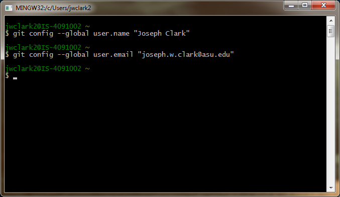
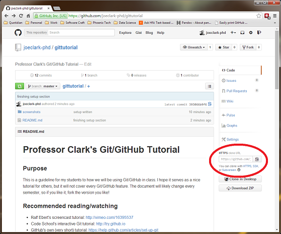
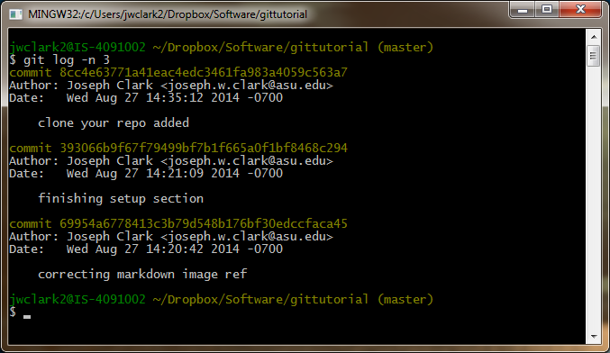
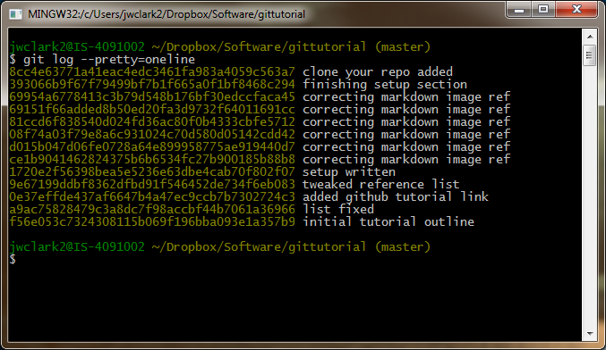
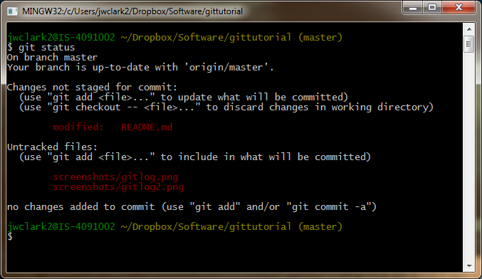
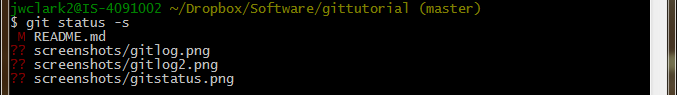
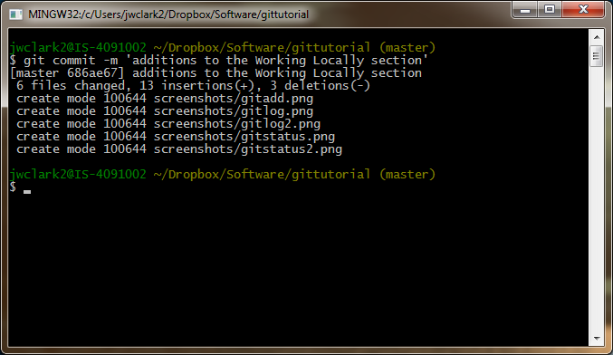
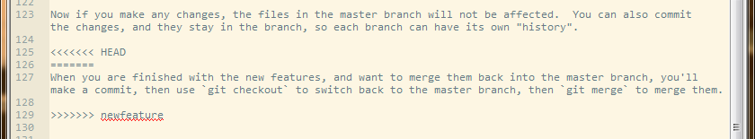
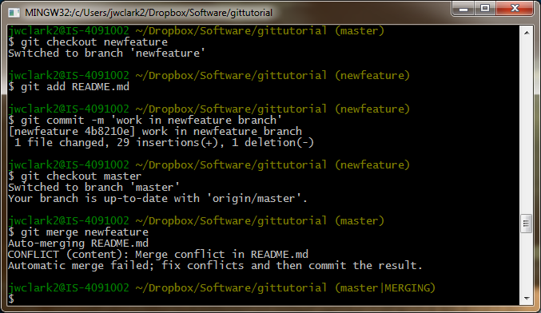

# Professor Clark's Git/GitHub Tutorial

###Purpose###

This is a guideline for my students to how we will be using Git/GitHub in class. I hope it serves as a nice tutorial for others, but it will not cover every Git/GitHub feature. The document will likely change every semester, so if you like it, fork the version you like! 

### Recommended reading/watching

- Ralf Ebert's screencast tutorial: http://vimeo.com/16395537
- Code School's interactive Git tutorial: http://try.github.io
- GitHub's own (very short) tutorial: https://help.github.com/articles/set-up-git
- Vincent Driessen's Git branching model for teams: http://nvie.com/posts/a-successful-git-branching-model/

### Set up Git

First: Install Git (not GitHub) on your system.  

- You can find the software here: http://www.git-scm.com/

There are graphical user interfaces for Git, but we'll use the command line for this tutorial.  On a Mac or Linux computer, open a terminal.  From Windows, you can use the `cmd` command line, but Git will have installed its own Unix-like shell called **Git Bash** and I recommend you use it.

Before using Git, you'll want to configure it with your name and e-mail.  Make sure this is the same e-mail address you used to create your GitHub account.

    git config --global user.name "Sparky Sundevil"
    git config --global user.email "sparky@asu.edu"

Please don't actually use Sparky's name.

### Clone your repository

You can create a repository on your local machine first, or on GitHub first.  In my classes, I'll create a repo for each team, so you'll use the "GitHub first" model.  The repository is already on GitHub, so you'll use `git clone` to make a repo on your local computer.

To do this, go to the repository on GitHub and look for the "clone URL" in the right column.  You'll want the HTTPS version of the URL, so click that term if necessary.

Now in the terminal, navigate to the folder within which you want the project to be stored.  Pro tip: If you do this in Dropbox or a similar cloud storage service, you will be able to access the project on any of your computers without having to worry about keeping them in sync.  Once you're where you want to be, type `git clone` followed by the URL of the repository.  For example, to clone *this* repo, you'd type:

    git clone https://github.com/joeclark-phd/gittutorial.git

This repository is open source, so feel free to try it.  This will create a new subfolder called `gittutorial` in your current directory, and everything Git needs is inside that folder.

- SSH is recommended over HTTPS but takes some setup.  [More info here](https://help.github.com/articles/generating-ssh-keys).

### Working solo

Your repo is a folder/directory on your computer which contains your files.  There's nothing unusual about it except that it contains a hidden folder called `.git` which keeps all the data used by Git.  This is nice because you can do all your work locally -- including referencing older versions, switching branches, etc -- without needing to connect to a remote server.  The only time you even need Internet access is when you want to push changes to GitHub for others to work with.  *Git can be used without GitHub or any other centralized server.*

Git keeps a history of "commits" which are snapshots of your project over time.  The `git log` commmand can be used to see who committed them, when, and what message they gave to explain the commit.  Add `-n` with a number to limit how many log entries you see:

    git log -n 3`

To see a cleaner version of the log, add the parameter `--pretty=oneline`.

Files in your working folder can be in one of three states:

- unchanged from the last commit
- changed in the working directory, but not staged for commit
- staged and ready for the next commit

If you type `git status` with a new repo,  you'll probably see that the working directory is "clean" meaning nothing has changed since the last commit.  Go ahead and edit a file in the folder, then type `git status` again.  This is what I'm seeing right now, after creating this section of the tutorial:

One file has been changed and two new ones have been added since the last commit.  A more succinct version of this output can be seen if you type `git status -s`:

#### Staging

If I want to commit those files, I need to `git add` them to the index, and *then* `git commit` them for the permanent record.  You can type `git add <filename>` for each and every modified file, but it's easier to just type `git add -A` to stage every new or changed file for the next commit.

Green means the files are indexed and ready to be committed.  

- Note: For newbies the `git add` step is the most confusing.  Why can't you just modify some files and then commit?  I suppose it's because you might have some changes in one file (i.e. a bug fix) that are ready for commit, but other changes in other files that aren't ready.  Only the "staged" files will be bundled into the next commit.  For now, just make `git add` a part of your workflow and assume it has a good reason.
- Note: Sometimes you want to prevent certain files from being accidentally staged, like system temporary files, or compiled Java or Python bytecode.  To do this, drop a `.gitignore` file in the top level of the repo.  Sample `.gitignore` files can be found here: https://github.com/github/gitignore

#### Committing

You don't have to commit every change, but it's a good practice to make frequent, small commits rather than occasional big ones.  The reason is that it makes it easier to see exactly when and where something entered the project (i.e. a bug); that's difficult when each commit includes a dozen unrelated changes.  Every commit needs a short message.  Type something like the following, but more informative:

    git commit -m 'this is my commit message'

Now this version of the code is stored in the history of the project.  You can go back to it, or others can fork (copy) your code from this point, or you can analyze the changes from one commit to the next.

* To see the changes made in this commit (compared to the previous one), type `git show <commit>` where `<commit>` is the label of the commit (686ae67 in the screenshot above).  Every commit has a unique hash to label it.

#### Pushing

It's important to remember that you are still working locally.  The latest commit is now permanently saved, so you can go back to it, or merge it with another branch, and you can continue working on the files without fear of losing or changing something that you really liked.  However, the latest commit is not yet shared with your teammates or the world.  For that, we need a central, public server like those provided by GitHub.com.

To push to your repo on GitHub, type:

    git push origin master

FYI, `master` is the "branch" you're working on now, and `origin` is the GitHub repo which is associated with your local repo.  Now check GitHub and see your changes!

- Note: `origin` is the repo which you cloned. If you created your own repo locally, before setting up a server, you'll need to associate your repo with the remote one by typing `git remote add origin <the repo's URL>` and then you should be able to `git push` as above.

### Working collaboratively

In my classes you'll be working with a team on a shared repository.  That means you will sometimes be making changes that need to be reconciled.  There are a couple of features of Git that enable this workflow.

Let's look at the simplest case.  You and your team have not "branched" the code but are all working on the `master` branch, and someone has made some updates and pushed them to GitHub.  To get the latest commits, you'll use `git pull`:

    git pull origin master

If there were no conflicts (that is to say, if the commits in your local repo are all in the "history" of the GitHub repo), you will be now be up-to-date with the version on GitHub.  You can go ahead and make your own changes and commits to the project.  Use `git push` to share them with the team via GitHub when you're done.  If there are conflicts (i.e., you've been making commits of your own in parallel with teammates), you'll be asked to resolve the conflicts and make a new commit.

#### Resolving conflicts

If you look inside the modified files you'll see something like this:

To resolve the conflicts, just correct the stuff between `<<<<<<< HEAD` and `>>>>>>> newfeature` (or whatever) to determine what the file ought to look like.  In this case it's easy, because the only difference is an addition.  If both paragraphs had different versions of the new paragraph, or an even more complicated conflict, you'd have to decide what to keep and what to delete.  Once your changes are made, you make an ordinary commit, and the master branch will be up to date.  It would be wise to then `git push` so that your teammates can see the resolved files on GitHub.

### Branching

A more sophisticated workflow involves branching the code.  Each branch may have its own history of commits, so you can use a branch to work on a new feature without affecting the main (or master) repository.  Each team member can work in their own branch, so they don't interfere with each other.  When finished, you merge the "feature" branch back into the master branch.

Vincent Driessen's [Git branching workflow](http://nvie.com/posts/a-successful-git-branching-model/), called "Git flow", is very popular and I'll use it in some of my classes.  For others, it's enough that you know how to make a branch to keep your experiments separate.  A small bug fix can be done in one branch that will soon be merged into the code, whereas a big new feature could be done in another branch that will not be merged until several weeks later when it's done.

To see what branches exist for your project, what's the latest commit for each branch, and which branch you're in (marked with a \*), type

    git branch -v

To create a new branch, type `git branch <new branch name>` like so:

    git branch newfeature

To switch to another branch, use `git checkout`:

    git checkout newfeature
    
Now if you make any changes, the files in the master branch will not be affected.  You can also commit the changes, and they stay in the branch, so each branch can have its own "history".

- To create a new branch from `master` and switch to it with one command, you could use `git checkout -b newfeature master`

When you are finished with the new features, and want to merge them back into the master branch, you'll make a commit, then use `git checkout` to switch back to the master branch, then `git merge` to merge them.

If the master branch has been changed in the meantime, however, there may be conflicts between the two branches, and you'll get a message like the one above: "Automatic merge failed; fix conflicts and then commit the result."  If you look inside the modified files you'll see something like this:

Just correct the stuff between `<<<<<<< HEAD` and `>>>>>>> newfeature` (or whatever) to determine what the file ought to look like.  In this case it's easy, because the only difference is an addition.  If both paragraphs had different versions of the new paragraph, or an even more complicated conflict, you'd have to decide what to keep and what to delete.  Once your changes are made, you make an ordinary commit, and the master branch will be up to date.

- Possibly interesting: type `gitk` for a kind of graphical interface that will show you the "map" of branches and merges in your project.
- When you use `git push origin master` it only pushes the master branch to GitHub, so your teammates will never have to worry about, or be bothered by, all the alternative branches you've created on your personal computer.  So branch away!
- When you reach a milestone, you can "name" a commit, so instead of the gobbledygook characters that normally identify it, it can be called something like "v0.1".  Use `git tag v0.1` to do this.

### Summary of workflows for students

This is a quick reference for how to use Git + GitHub for students in my classes.  There are two workflows, a simple one and a more professional one.

#### Simple workflow for teams

1. Create a repo on GitHub and clone it locally with `git clone`.
2. Before sitting down to work, use `git pull origin master` to get the latest updates from your teammates.
3. Do some work locally:
    1. Add or change some files with whatever software you normally use.
    2. Stage the changes with `git add -A`.
    3. Commit them with `git commit -m 'some message about the changes'`.
    4. Repeat.
3. Upload your work to GitHub by typing `git push origin master`.
    - If someone else has pushed changes in the meantime, you'll get a message about conflicts.  In that case, do `git pull origin master`, fix the conflicts, `commit`, and `push`.

#### Git-flow workflow for teams

Reference:  http://nvie.com/posts/a-successful-git-branching-model/

When working on a new feature:

1. Create a repo and clone it locally.
    1. First time: use `git branch -v` to see if there is a `develop` branch yet.  If not, do `git checkout -b develop master` to create this branch, where your team will be doing its work.
    2. If `develop` exists, use `git checkout develop` to make sure you're working in that branch.
2. Before starting a new piece of work, use `git pull origin develop` to get the latest changes from your teammates.
3. Create a feature branch for something new you're working on with `git checkout -b myfeature develop`.  This is a branch off `develop`.
4. Do all the work you want in the `myfeature` branch.  You can have more than one of these branches if you're working on different things.  The names of the branches don't matter because your teammates won't see them.
5. When your feature is complete, merge it back into the `develop` branch:
    1. First, `git pull origin develop` so you have the latest version of `develop`.
    2. Switch to the development branch with `git checkout develop`.
    3. Merge in the feature with `git merge --no-ff myfeature`, resolving conflicts if necessary.
    4. Share the new feature with your team by doing `git push origin develop`.
    
When you're ready to release a new version (as an assignment for credit):

1. Make sure all teammates work, if it's ready, has been integrated into `develop` as above, and pushed to `origin` aka GitHub.
2. Create a release prep branch from `develop`:
    1. One person enters `git checkout -b release-0.1 develop` (or whatever release number).
    2. Share it with the team by doing `git push origin release-0.1`.  
    3. Everyone else can `git pull origin release-0.1` and switch to the release prep branch with `git checkout release-0.1`.
3. Make sure the release is satisfactory: 
    1. Do all the testing you need and fix any bugs.
    2. Update the README file.  
    3. Make sure all team members have committed and pushed any needed changes to GitHub with `git push origin release-0.1`.
4. Release the next version:
    1. Switch to the release branch: `git checkout master`
    2. Merge the prepared release in: `git merge --no-ff release-0.1` (fix conflicts if necessary)
    3. Tag the release: `git tag -a 0.1`
5. Prepare for the further development:
    1. Switch back to the development branch: `git checkout develop`
    2. Merge in any bug fixes or changes you made during release prep: `git merge --no-ff release-0.1`
    3. Update everyone: `git push origin develop`
    4. Everyone gets the update: `git pull origin develop`
    5. Go back to step 1 and build more features branching off of `develop`
    
Final note: My grading for [CIS440](https://github.com/asu-cis-capstone) will be based on what I see in the `master` branch only, so you don't have to follow all these steps religiously.  However, you will still need to make sure your releases in `master` are "clean".  This is a proven way to do that well.
    