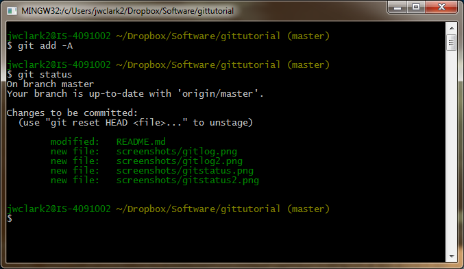

# Professor Clark's Git/GitHub Tutorial

###Purpose###

This is a guideline for my students to how we will be using Git/GitHub in class. I hope it serves as a nice tutorial for others, but it will not cover every Git/GitHub feature. The document will likely change every semester, so if you like it, fork the version you like! 

### Recommended reading/watching

- Ralf Ebert's screencast tutorial: http://vimeo.com/16395537
- Code School's interactive Git tutorial: http://try.github.io
- GitHub's own (very short) tutorial: https://help.github.com/articles/set-up-git
- Vincent Driessen's Git branching model for teams: http://nvie.com/posts/a-successful-git-branching-model/

### Set up Git

First: Install Git (not GitHub) on your system.  

- You can find the software here: http://www.git-scm.com/

There are graphical user interfaces for Git, but we'll use the command line for this tutorial.  On a Mac or Linux computer, open a terminal.  From Windows, you can use the `cmd` command line, but Git will have installed its own Unix-like shell called **Git Bash** and I recommend you use it.

Before using Git, you'll want to configure it with your name and e-mail.  Make sure this is the same e-mail address you used to create your GitHub account.

    git config --global user.name "Sparky Sundevil"
    git config --global user.email "sparky@asu.edu"

Please don't actually use Sparky's name.

### Clone your repository

You can create a repository on your local machine first, or on GitHub first.  In my classes, I'll create a repo for each team, so you'll use the "GitHub first" model.  The repository is already on GitHub, so you'll use `git clone` to make a repo on your local computer.

To do this, go to the repository on GitHub and look for the "clone URL" in the right column.  You'll want the HTTPS version of the URL, so click that term if necessary.

Now in the terminal, navigate to the folder within which you want the project to be stored.  Pro tip: If you do this in Dropbox or a similar cloud storage service, you will be able to access the project on any of your computers without having to worry about keeping them in sync.  Once you're where you want to be, type `git clone` followed by the URL of the repository.  For example, to clone *this* repo, you'd type:

    git clone https://github.com/joeclark-phd/gittutorial.git

This repository is open source, so feel free to try it.  This will create a new subfolder called `gittutorial` in your current directory, and everything Git needs is inside that folder.

- SSH is recommended over HTTPS but takes some setup.  [More info here](https://help.github.com/articles/generating-ssh-keys).

### Working locally

Your repo is a folder/directory on your computer which contains your files.  There's nothing unusual about it except that it contains a hidden folder called `.git` which keeps all the data used by Git.  This is nice because you can do all your work locally -- including referencing older versions, switching branches, etc -- without needing to connect to a remote server.  The only time you even need Internet access is when you want to push changes to GitHub for others to work with.  *Git can be used without GitHub or any other centralized server.*

Git keeps a history of "commits" which are snapshots of your project over time.  The `git log` commmand can be used to see who committed them, when, and what message they gave to explain the commit.  Add `-n` with a number to limit how many log entries you see:

    `git log -n 3`

To see a cleaner version of the log, add the parameter `--pretty=oneline`.

Files in your working folder can be in one of three states:

- unchanged from the last commit
- changed in the working directory, but not staged for commit
- staged and ready for the next commit

If you type `git status` with a new repo,  you'll probably see that the working directory is "clean" meaning nothing has changed since the last commit.  Go ahead and edit a file in the folder, then type `git status` again.  This is what I'm seeing right now, after creating this section of the tutorial:

One file has been changed and two new ones have been added since the last commit.  A more succinct version of this output can be seen if you type `git status -s`:

If I want to commit those files, I need to `git add` them to the index, and *then* `git commit` them for the permanent record.  You can type `git add <filename>` for each and every modified file, but it's easier to just type `git add -A` to stage every new or changed file for the next commit.

Green means the files are indexed and ready to be committed.  You don't have to commit every change, but it's a good practice to make frequent, small commits rather than occasional big ones.  The reason is that it makes it easier to see exactly when and where something entered the project (i.e. a bug); that's difficult when each commit includes a dozen unrelated changes.  Every commit needs a short message.  Type something like the following, but more informative:

    git commit -m 'this is my commit message'

It's important to remember that you are still working locally.  The latest commit is now permanently saved, so you can go back to it, or merge it with another branch, and you can continue working on the files without fear of losing or changing something that you really liked.  However, the latest commit is not yet shared with your teammates or the world.  For that, we need a central, public server like those provided by GitHub.com.

To push to your repo on GitHub, type:

    git push origin master

FYI, `master` is the "branch" you're working on now, and `origin` is the GitHub repo which is associated with your local repo.  Now check GitHub and see your changes!

- Note: `origin` is the repo which you cloned. If you created your own repo locally, before setting up a server, you'll need to associate your repo with the remote one by typing `git remote add origin <the repo's URL>` and then you should be able to `git push` as above.

### Working with multiple branches

TODO: use `git pull` to get latest updates from teammates?

TODO: how to use `git checkout` and `git pull` to work with multiple branches and resolve merge conflicts

TODO: the git-flow branching model we'll use for the team, including `git tag`

